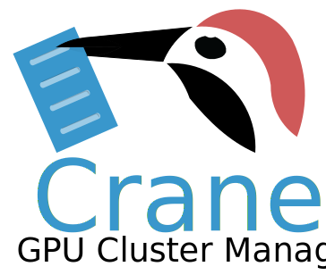

  

Crane is an open-source GPU cluster manager with batteries included. It supports elastic GPU resource scheduling for diverse deep learning workloads.

Crane provides isolation between different users through its user authentication and job submission interface.

Users can sign in from any node in the Crane cluster and submit jobs through Crane's interface. Advanced users may submit jobs that declare and reserve a *Mini-cluster* and request the Crane cluster manager to run small *Cargoes*.

## Documentation

The Crane user documentation can be found at [Crane Docs](https://friendliai.github.io/crane/).

## Installation

Crane requires Python (3.7 or higher) and Docker Engine (1.12 or higher) on host machines.

See the [installation guide](https://friendliai.github.io/crane/pages/Quick-Start/user/) in our documentation.

## Cluster Assumptions

Crane makes a series of assumptions on the cluster and users.

- Crane can be deployed flexibly to any network interface that supports Docker swarm. It is the cluster administrator's duty to secure the network itself.
- Aside from deep learning computation jobs, Crane also supports serving jobs such as jupyter notebooks for development. It is up to the user to secure exposed ports from external intrusion.
- Crane fully isolates users from each other through its user authentication interface. Yet, it doesn't prevent malicious users from killing containers directly.

## Contribution

See the [contribution guide](https://friendliai.github.io/crane/pages/contribution-guide/) for details on installing for development and an overview of the features provided for the ease of the developer.

## License

Crane is licensed under [Apache 2.0](LICENSE).
